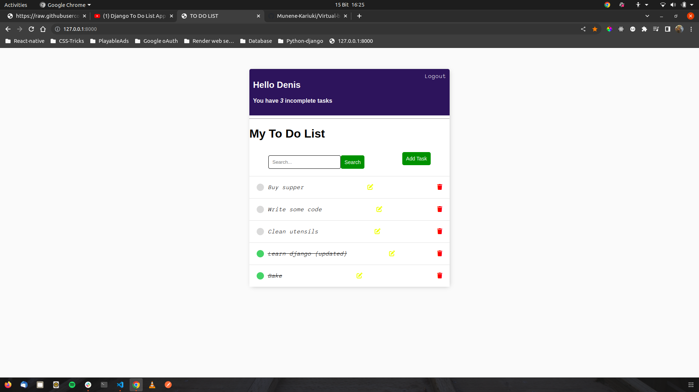

# TO DO LIST

This is a simple to-do list. The application allows users to create, retrieve, update, and delete tasks. A user can only see tasks associated with their account. The application also allows users to sign up or log into the application. The application uses Django for the back-end logic and interaction with the database, HTML templates for the front-end logic, and CSS for styling.

#### By **Denis** created on, 14th March 2023

## Screenshot
   

## Table of Content

- [Description](#description)
- [Design](#design)
- [Behavior of the website](#behaviour-of-the-website)
- [Development and set up](#development-and-setUp)
- [Getting started](#Getting-started)
- [Live link](#Live-Link)
- [Technology Used](#technology-and-tools-Used)
- [License](#license)
- [Authors Info](#Authors-info)

## Description

A webpage showing a user tasks by order of completion status. The application allows a user to create, edit, retrieve and update tasks. The page uses Django and HTML templates to render the site.

## Design
N/A

## Behaviour of the website
### View
+ The website is visually appealing.
+ The site lists all tasks by order of completion status. Incomplete tasks are rendered first.
+ The site allows a user to create a new task.
+ Clicking on the delete icon deletes a task from my to-do list.
+ Clicking on the edit button allows a user to update task information.
+ The website authenticates existing users and allows new users to sign up for the application.
+ The search bar filters tasks by the first word.

## Development and Setup.

This assumes that `python3` is linked to a valid installation of python 3 and that `pip` is installed and `pip3`is valid
for installing Python 3 packages.

Installing inside virtualenv is recommended, however, you can start your project without virtualenv too.

If you don't have Django installed for Python 3 then run:

    $ pip3 install django

### Getting started
First, clone the repository from GitHub and switch to the new directory:

    $ git clone git@github.com:Munene-Kariuki/Todo-list-django.git
    $ cd Todo-list-Django
    
Activate the virtual environment for your project.
    
Install project dependencies:

    $ pip install -r requirements/local.txt
    
    
Then simply apply the migrations:

    $ python manage.py migrate
    

You can now run the development server:

    $ python manage.py runserver    

### Live Link
* The application is deployed at https://web-production-9bf6.up.railway.app

## Technology and Tools Used

+ HTML5
+ CSS5
+ Python
+ Django
- Git - Version control
- Vs code- Code Editor

## License
MIT License

Copyright (c) [2023] [Denis Kariuki]

Permission is hereby granted, free of charge, to any person obtaining a copy
of this software and associated documentation files (the "Software"), to deal
in the Software without restriction, including without limitation the rights
to use, copy, modify, merge, publish, distribute, sublicense, and/or sell
copies of the Software, and to permit persons to whom the Software is
furnished to do so, subject to the following conditions:

The above copyright notice and this permission notice shall be included in all
copies or substantial portions of the Software.

THE SOFTWARE IS PROVIDED "AS IS", WITHOUT WARRANTY OF ANY KIND, EXPRESS OR
IMPLIED, INCLUDING BUT NOT LIMITED TO THE WARRANTIES OF MERCHANTABILITY,
FITNESS FOR A PARTICULAR PURPOSE AND NONINFRINGEMENT. IN NO EVENT SHALL THE
AUTHORS OR COPYRIGHT HOLDERS BE LIABLE FOR ANY CLAIM, DAMAGES OR OTHER
LIABILITY, WHETHER IN AN ACTION OF CONTRACT, TORT OR OTHERWISE, ARISING FROM,
OUT OF OR IN CONNECTION WITH THE SOFTWARE OR THE USE OR OTHER DEALINGS IN THE
SOFTWARE.

## Author's info
Linked in - [Denis Kariuki]
